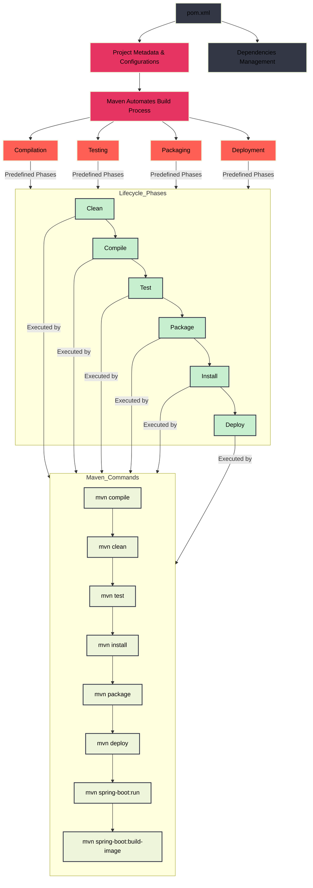

# Ⓜ️ Maven

### 🛠️ Build tool (project & automation)

### ❓ What is Maven?

Imagine you are building a toy car. You have various parts like wheels, body, and engine, and you need to put them together in the right way to make the car work. **Maven** is like a special tool that helps you build your toy car by following a step-by-step process. It makes sure everything is done in the right order and nothing is missed out.

So in short, it is a build tool to standardize the way to manage Java projects.

It does that by defining project structure, dependencies, and build configurations in a **pom.xml** file.

Developers use it to define various things such as project metadata, configurations, and so on.

In **Spring Boot**, spring frameworks along with various other modules like Spring MVC are managed as dependencies by Maven.

So basically, when you create your own Spring Boot app and want to change the configurations or add dependencies, you can simply add it in the **pom.xml** file and let Maven handle the rest. Here’s an example to add the Spring WEB dependency:

```xml
  <dependencies>
    <dependency>
      <groupId>org.springframework.boot</groupId>
      <artifactId>spring-boot-starter-web</artifactId>
    </dependency>
    ...other dependencies
   </dependencies>
```

### 🤖 Maven Build Automation

- **Maven automates the build process:**
    - Maven helps you put together your software project automatically. It takes care of important steps like:
        - **Compilation:** Turning your written code into a format the computer can understand.
        - **Testing:** Checking if your code works correctly.
        - **Packaging:** Bundling your code into a single file.
        - **Deployment:** Preparing your code to be used in real-world situations.
- **Predefined build lifecycle phases:**
    - Maven follows a set of steps in a specific order, like:
        - **Clean:** Removing old files from previous builds.
        - **Compile:** Converting your code into a usable format.
        - **Test:** Making sure everything works.
        - **Package:** Creating a single file with all your code.
        - **Install:** Storing the packaged file for later use.
- **Building and packaging Spring applications:**
    - Maven helps create and prepare Spring applications by bundling them into files like:
        - **JAR files:** Single files containing everything needed to run your application.
        - **WAR files:** Special files for web applications.

  These files can then be used in production environments, meaning they are ready to be used in the real world.

### 🌱 How Does Maven Help with Spring Applications?

Spring applications are a type of software project. Maven helps build these projects by:

- **Building and Packaging:** It takes your Spring application code and bundles it into a deployable file. This file can be a **JAR file** (like a single box containing all parts of your toy car) or a **WAR file** (a box designed specifically for web applications).
- **Deployment:** Once packaged, the file is ready to be deployed (or put to use) in a production environment, which is like taking your finished toy car to a race track to see it in action.

### 🧩 Maven Commands

- **mvn compile:** We compile the project's source code using the `mvn compile` command.
- **mvn clean:** Using the `mvn clean` command, all previous build files are removed from the project.
- **mvn test:** We execute project testing steps with the `mvn test` command.
- **mvn install:** The `mvn install` command aids in deploying packaged WAR or JAR files by storing them in the local repository as classes.
- **mvn package:** The `mvn package` command generates a WAR or JAR file for the project so that it can be distributed.
- **mvn deploy:** The `mvn deploy` command is used after compilation, project testing, and project building. The packaged WAR or JAR files are copied to the remote repository so other developers can use them.
- **mvn spring-boot:run:** Runs a Spring Boot application directly from the source code without packaging it into a JAR or WAR file.
- **mvn spring-boot:build-image:** Builds a Docker image of the Spring Boot application using the Spring Boot Maven plugin.

